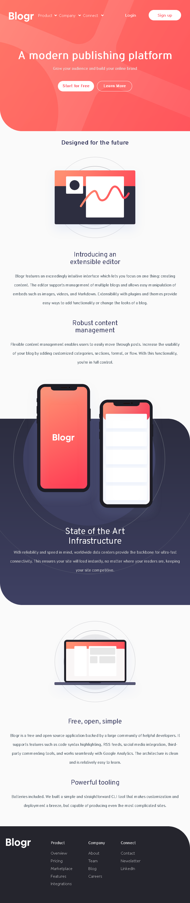
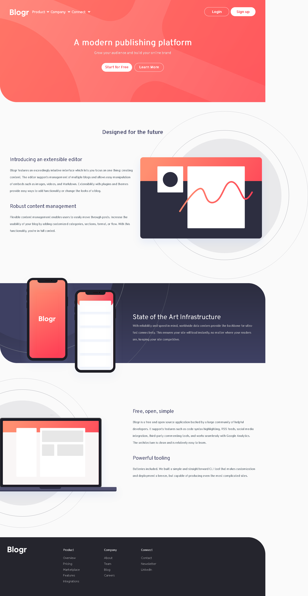

# Frontend Mentor - Blogr landing page solution

This is a solution to the [Blogr landing page challenge on Frontend Mentor](https://www.frontendmentor.io/challenges/blogr-landing-page-EX2RLAApP). Frontend Mentor challenges help you improve your coding skills by building realistic projects. 

## Table of contents

- [Overview](#overview)
  - [The challenge](#the-challenge)
  - [styles guide](#style-guide)
  - [Screenshot](#screenshot)
  - [Links](#links)
  - [Built with](#built-with)
- [Author](#author)

## Overview

### The challenge

Users should be able to:

- View the optimal layout for the site depending on their device's screen size
- See hover states for all interactive elements on the page

### Style guide
**Layout**

The designs were created to the following widths:
- Mobile: 375px
- Desktop: 1440px

**Colors**
- Light red (CTA text): hsl(356, 100%, 66%)
- Very light red (CTA hover background): hsl(355, 100%, 74%)
- Very dark blue (headings): hsl(208, 49%, 24%)
- White (text): hsl(0, 0%, 100%)
- Grayish blue (footer text): hsl(240, 2%, 79%)
- Very dark grayish blue (body copy): hsl(207, 13%, 34%)
- Very dark black blue (footer background): hsl(240, 10%, 16%)

*Background gradient - Intro/CTA mobile nav:*

- Very light red: hsl(13, 100%, 72%)
- Light red: hsl(353, 100%, 62%)

*Background gradient - body:*

- Very dark gray blue: hsl(237, 17%, 21%)
- Very dark desaturated blue: hsl(237, 23%, 32%)

**Fonts**

- Family: [Overpass](https://fonts.google.com/specimen/Overpass?preview.text_type=custom)
- Weights: 300, 600

- Family: [Ubuntu](https://fonts.google.com/specimen/Ubuntu?preview.text_type=custom)
- Weights: 400, 500, 700

### Screenshot

### Links

- Solution URL: [Click here](https://www.frontendmentor.io/solutions/mobile-first-scss-bootstrap-javascript-YUKTB9YBw)
- Live Site URL: [Click here](https://hatwell-jonel.github.io/frontendmentor-blogr-landingpage/)

### Built with

- Semantic HTML5 markup
- CSS custom properties
- Flexbox
- CSS Grid
- Mobile-first workflow

### Author

- LinkedIn - [Jonel Hatwell](https://www.linkedin.com/in/jonel-hatwell/)
- Frontend Mentor - [@hatwell-jonel](https://www.frontendmentor.io/profile/hatwell-jonel)
